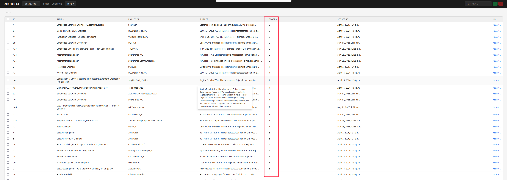
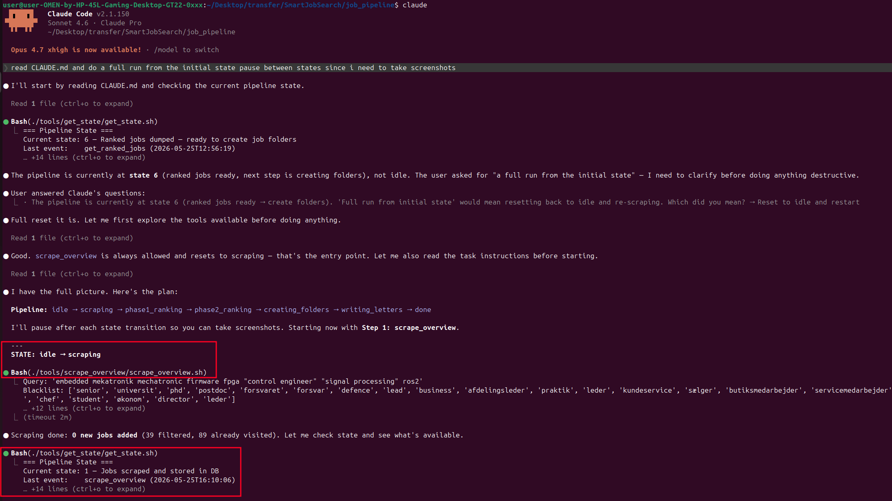
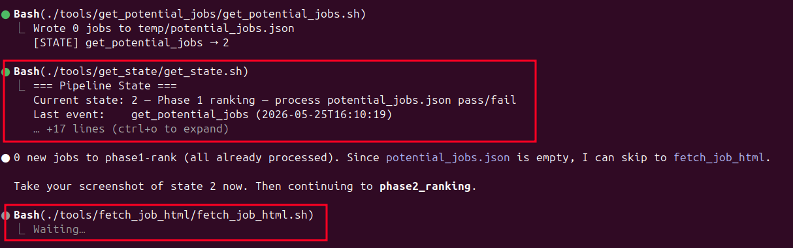
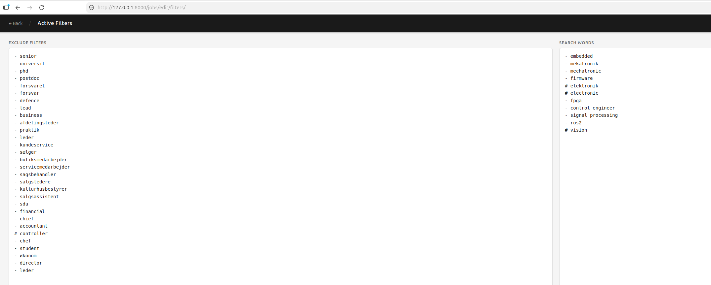
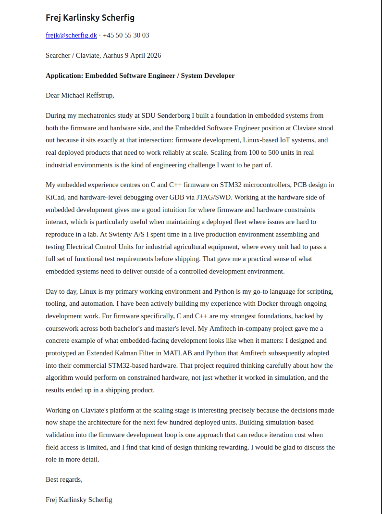

# SmartJobHunt

> Automated job-hunting pipeline that scrapes listings, ranks them against your profile using AI, and drafts cover letters — all from the terminal.


## Overview

SmartJobHunt scrapes job postings, runs them through a two-phase AI ranking pipeline (powered by Claude Code), and generates tailored cover letters — matched to your skills, experience, and writing style. A lightweight Django frontend lets you browse results, edit letters, and manage the pipeline state.  
The project was built to solve a real problem: applying to dozens of embedded-systems jobs without copy-pasting the same generic letter. Every cover letter is grounded in a structured competence profile and calibrated against example letters you provide.  
Below there is a youtube video attached that demonstrates Django application, while screenshots from claude code running in the command line is shown at the screenshot section:
<br clear="all" />
<a href="https://youtu.be/P7UGkErQfZg">
  
</a>
<br clear="all" />

## Key Skills Demonstrated

`Python` · `Django` · `SQLite` · `Claude Code / AI Tooling` · `Shell Scripting` · `State Machine Design` · `Web Scraping`

## How It Works

The pipeline follows a strict forward path through six states:

```
idle → scraping → phase1_ranking → phase2_ranking → creating_folders → writing_letters → done
```

Each transition is driven by shell-based tools that Claude Code calls autonomously. The system is designed so that if Claude's context window fills up mid-task, it saves progress and resumes cleanly on the next invocation.

<!-- TODO: Replace with actual architecture diagram -->
```
┌──────────┐     ┌──────────────┐     ┌──────────────┐     ┌────────────────┐
│  Scraper │────▶│ Phase 1 Rank │────▶│ Phase 2 Rank │────▶│ Letter Writer  │
│ (jobindex)│     │  (bulk filter)│     │ (deep match) │     │ (per-job draft)│
└──────────┘     └──────────────┘     └──────────────┘     └────────────────┘
      │                                                            │
      ▼                                                            ▼
  jobs_data/                                              jobs_data/potential/
  raw listings                                            <id>/cover_letter.md
```
### Scraping
Scraping queries jobs from jobindex tied to filters applied. It keeps an internal record of jobs that has already been processed by the user or discarded by the system to lighten the workload.

### Phase 1 — Bulk Ranking

Quickly filters all scraped jobs against your competence profile. Jobs that clearly don't match are discarded.

### Phase 2 — Deep Ranking

Remaining jobs are evaluated in detail, by comparing to the employers job applications html implementation: The ranking process focuses on skill overlap, seniority fit, location, and language. Each job gets a score and a short rationale.

### Cover Letter Generation

For each job that passes ranking, a cover letter is drafted using your `profile.md` (background, tone, framing guidelines) and calibrated against reference letters in `examples/`.

## Project Structure

```
.
├── claude_tasks/       # Task instructions for each pipeline state
├── competences/        # Structured candidate skills and experience
├── editor/             # Django app — browse jobs, edit letters
├── examples/           # Reference cover letters for tone calibration
├── jobs/               # Django app — job data models and management
├── pipeline/           # State machine logic and transitions
├── scripts/            # Scraping and utility scripts
├── tools/              # Shell tools called by Claude Code
├── CLAUDE.md           # Agent instructions (Claude Code config)
├── profile.md          # Candidate background and tone preferences
├── manage.py
└── requirements.txt
```

## Getting Started

### Prerequisites

- Python 3.10+
- Claude Code CLI (for the AI pipeline stages)
- A Jobindex account (or adapt `scripts/` for your job board)

### Setup

```bash
git clone https://github.com/FrejProfile/SmartJobHunt.git
cd SmartJobHunt
pip install -r requirements.txt
python manage.py migrate
```

### Running the Pipeline

```bash
# Check current pipeline state
./tools/get_state/get_state.sh

# Launch Django UI to browse results
python manage.py runserver
```

The AI stages are driven by Claude Code — see `CLAUDE.md` for the full agent workflow.

## Screenshots
Screenshots below shows claude code scrabing jobindex and performing the initial ranking through its allowed tools:
<p>
  
</p>

<p>
  
</p>

Filters are implemented in two mardown files and is used in the query from jobindex and as a guard against unwanted jobs which might appear. These can also be edited directly from within the Django GUI:
<p>
  
</p>

Ranked jobs example:
<p>
  
</p>

Coverletter example: 
<p>
  
</p>


## What I Learned

- Designing a state machine that an AI agent can navigate reliably, with save/resume across context windows
- Structuring competence data so an LLM can do meaningful skill-matching rather than keyword grep
- The importance of tone calibration — early drafts were either too hedging or too generic until I added example-based style anchoring

## License

GPL-3.0